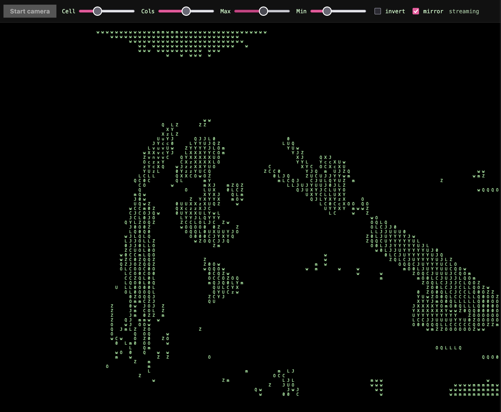

# asciicam



webcam -> ascii art, rendered in a browser.


## https://ijsbol.github.io/asciicam/

## for running locally 

build

```
wasm-pack build --target web --release --out-dir web/pkg --no-pack
cargo build --release
```

```
./target/release/asciicam 1234  # hosts on http://localhost:1234
```

open the URL, click **start camera**, grant permission, enjoy :p
